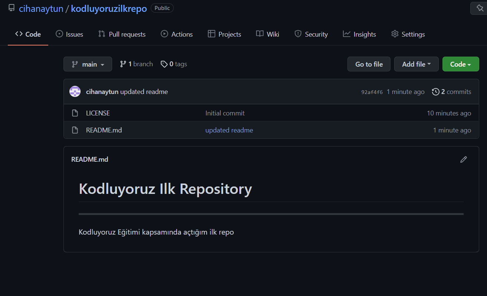

#Patika Dev
---
Bu repo [Kodluyoruz](https://www.kodluyoruz.org) Git Eğitiminde oluşturduğumuz ilk repo. 

## _Veri Yapıları Ve Algoritmalar_
- [binary_tree_search_project](https://github.com/cihanaytun/patika-dev/blob/main/data_structures_and_algorithms/binary_tree_search_project/project_3.png)
- [insertion_sort_project](https://github.com/cihanaytun/patika-dev/blob/main/data_structures_and_algorithms/insertion_sort_project/Proje.txt)
- [merge_sort_project](https://github.com/cihanaytun/patika-dev/blob/main/data_structures_and_algorithms/merge_sort_project/project_2.png)

## *C# 101*
- [console_programlama](https://github.com/cihanaytun/patika-dev/blob/main/cSharp_101/console_programlama/Program.cs) 
- [degiskenler](https://github.com/cihanaytun/patika-dev/blob/main/cSharp_101/degiskenler/Program.cs)
- [operatorler](https://github.com/cihanaytun/patika-dev/blob/main/cSharp_101/operatorler/Program.cs) --> Atama ve işlemli atama operatörleri | Mantıksal operatorler | İliskisel operatorler | Aritmatiksel operatorler
- [tip_donusumleri](https://github.com/cihanaytun/patika-dev/blob/main/cSharp_101/tip_donusumleri/Program.cs) --> Implicit Conversion (Bilinçsiz dönüşüm) | Explicit conversion (Bilinçli dönüşüm) | ToString Methodu  | System.Convert | Parse
- [hata_yonetimi](https://github.com/cihanaytun/patika-dev/blob/main/cSharp_101/hata_yonetimi/Program.cs)
- [if_else_if](https://github.com/cihanaytun/patika-dev/blob/main/cSharp_101/if_else_if/Program.cs)
- [switch_case](https://github.com/cihanaytun/patika-dev/blob/main/cSharp_101/switch_case/Program.cs)
- diziler
  * [diziler_1](https://github.com/cihanaytun/patika-dev/blob/main/cSharp_101/diziler/diziler_1/Program.cs) 
  * [diziler_2](https://github.com/cihanaytun/patika-dev/blob/main/cSharp_101/diziler/diziler_2/Program.cs) --> Sort | Clear | Reverse | IndexOf | Resize 
- metotlar
  * [metotlar_1](https://github.com/cihanaytun/patika-dev/blob/main/cSharp_101/metotlar/metotlar_1/Program.cs) --> Ref Parametr 
  * [metotlar_2](https://github.com/cihanaytun/patika-dev/blob/main/cSharp_101/metotlar/metotlar_2/Program.cs) --> Out Parametr | Overloading metot
  * [metotlar_3](https://github.com/cihanaytun/patika-dev/blob/main/cSharp_101/metotlar/metotlar_3/Program.cs) --> Reküsif - Öz yinelemeli 
  * [metotlar_4](https://github.com/cihanaytun/patika-dev/blob/main/cSharp_101/metotlar/metotlar_4/Program.cs) --> String Method
  * [metotlar_5](https://github.com/cihanaytun/patika-dev/blob/main/cSharp_101/metotlar/metotlar_5/Program.cs) --> DateTime ve Math Method
- koleksiyonlar
  * [koleksiyonlar_1](https://github.com/cihanaytun/patika-dev/blob/main/cSharp_101/koleksiyonlar/koleksiyonlar_1/Program.cs) --> Generic List
  * [koleksiyonlar_2](https://github.com/cihanaytun/patika-dev/blob/main/cSharp_101/koleksiyonlar/koleksiyonlar_2/Program.cs) --> Array List
  * [koleksiyonlar_3](https://github.com/cihanaytun/patika-dev/blob/main/cSharp_101/koleksiyonlar/koleksiyonlar_3/Program.cs) --> Dictionary 
- classes
  * [class_1](https://github.com/cihanaytun/patika-dev/blob/main/cSharp_101/classes/class_1/Program.cs)  --> Sınıf Nedir ? Instance, Field, Property
  * [class_2](https://github.com/cihanaytun/patika-dev/blob/main/cSharp_101/classes/class_2/Program.cs) --> Erişim Belirleyiciler ve Kurucu Fonksiyonlar
  * [class_3](https://github.com/cihanaytun/patika-dev/blob/main/cSharp_101/classes/class_3/Program.cs) --> Encapsulation ve Property Kavramı
  * [class_4](https://github.com/cihanaytun/patika-dev/blob/main/cSharp_101/classes/class_4/Program.cs) --> Static Sınıf ve Üyeler
  * [class_5](https://github.com/cihanaytun/patika-dev/blob/main/cSharp_101/classes/class_5/Program.cs) --> Struct(Yapı) Kavramı  
  * [class_6](https://github.com/cihanaytun/patika-dev/blob/main/cSharp_101/classes/class_6/Program.cs) --> Enumlar
- OOP(Object Oriented programming)
  * [OOP_1](https://github.com/cihanaytun/patika-dev/tree/main/cSharp_101/oop/oop_1) -->Inheritance | Polymorphism | sealed class
  * OOP_2
     [OOP_2.1](https://github.com/cihanaytun/patika-dev/tree/main/cSharp_101/oop/oop_2/oop_2.1) --> Interface
     [OOP_2.2](https://github.com/cihanaytun/patika-dev/tree/main/cSharp_101/oop/oop_2/oop_2.2)

## License
[MIT](https://choosealicense.com/licenses/mit/)
